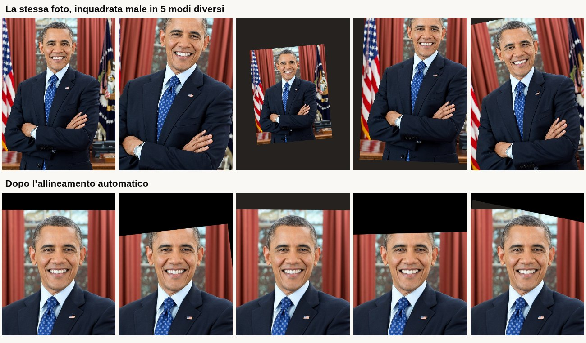

# OGGI

Un selfie al giorno, allineato automaticamente.

Ogni foto viene portata dentro una cornice fissa 4:5 in modo che **occhi e bocca
cadano sempre nello stesso punto**. Scorri i giorni e la faccia resta ferma
mentre cambia tutto il resto: la luce, i capelli, lo sfondo, tu.

## Aprila

**→ https://fabioselvaggio.github.io/selfie/**

> **Da fare una volta sola**, se il link dà 404: su GitHub, *Settings → Pages →
> Build and deployment → Source: **GitHub Actions***. Poi *Actions → Deploy su
> GitHub Pages → Re-run jobs*. Il token di Actions non può accendere Pages da
> solo, è l'unico passaggio manuale.

Aprila dal telefono e aggiungila alla schermata Home: parte a tutto schermo,
senza barre del browser, come un'app vera.

- **iPhone** — Safari → tasto Condividi → *Aggiungi a Home*
- **Android** — Chrome → menu ⋮ → *Installa app*

Al primo avvio scarica ~4 MB di modello per il riconoscimento del viso. Da lì in
poi funziona **senza connessione**, anche al primo riavvio. Le foto restano sul
telefono: non passano da nessun server, nemmeno il mio.



Sopra: la stessa foto inquadrata male in cinque modi diversi. Sotto: dopo
l'allineamento. Dove lo scatto non copre la cornice resta il nero — è voluto,
non è un ritaglio mancato.

## Come funziona l'allineamento

Il rilevamento usa **MediaPipe Face Landmarker** (478 punti, iridi comprese) e
gira interamente nel browser: le foto non escono mai dal dispositivo.

Da ogni volto prendiamo tre punti:

| punto | landmark | perché |
|---|---|---|
| iride sinistra | 468 | il centro dell'iride non si sposta quando strizzi gli occhi, gli angoli sì |
| iride destra | 473 | idem |
| centro bocca | media di 13, 14, 61, 291 | terzo vincolo, stabilizza l'inclinazione della testa |

Su questi tre punti risolviamo una **similarità ai minimi quadrati pesati**
(forma chiusa 2D di Horn): rotazione, scala uniforme e traslazione — quattro
gradi di libertà, nessuna deformazione prospettica.

I due occhi da soli determinano già esattamente la trasformazione. La bocca
entra con un peso configurabile (`mouthWeight`, default `0.2`): aiuta quando la
testa è inclinata avanti o indietro, ma se pesa troppo combatte con gli occhi
quando guardi in basso.

La destinazione è parametrica in `src/lib/faceAlign.ts`:

```
TARGET_IPD_RATIO   0.17   distanza fra le pupille, in frazioni della larghezza cornice
TARGET_EYE_Y       0.40   altezza della linea degli occhi
TARGET_MOUTH_DROP  1.15   distanza occhi→bocca, in multipli della distanza interpupillare
```

`TARGET_IPD_RATIO` decide l'inquadratura: `0.17` è un mezzobusto (testa e
spalle). Alzarlo stringe sul viso, ma costringe a ingrandire di più e
l'immagine si ammorbidisce.

Due dettagli che fanno la differenza sulla qualità:

- **Rilevamento in due passate.** La prima trova il viso, la seconda rifà il
  rilevamento su un ritaglio ingrandito attorno al viso. Il modello lavora
  internamente a 192×192: dandogli il ritaglio invece della foto intera gli
  mettiamo molti più pixel sulla faccia.
- **Downscale progressivo.** Una foto da 12 MP dentro una cornice da 900 px
  viene ridotta a metà a più riprese prima del `drawImage` finale, altrimenti
  il ricampionamento fa aliasing e i capelli diventano un pettine.

## Quanto è preciso

`npm run verify:alignment` prende **una sola foto**, ne fabbrica cinque varianti
con rotazione, zoom e traslazione note — cioè simula la stessa faccia
fotografata male in cinque giorni diversi — e misura dove finiscono davvero i
punti nelle uscite.

La metrica che conta non è l'errore assoluto rispetto al bersaglio: uno
scostamento sistematico sposta tutti i fotogrammi allo stesso modo e resta
invisibile. Quello che si vede nel timelapse è la **dispersione fra un giorno e
l'altro**.

Con i default (`mouthWeight 0.2`, alta precisione), su cornice 1200×1500:

| misura | valore | in proporzione |
|---|---|---|
| σ centro occhi | 0,71 px | 0,06% della larghezza |
| σ distanza interpupillare | 1,62 px | 0,8% |
| σ angolo | 0,17° | — |
| tempo per foto | ~620 ms | (~340 ms senza alta precisione) |

Le rotazioni applicate vengono annullate esattamente: −11° → +11,4°, +7° →
−6,5°, e così via.

### Nitidezza

`npm run verify:sharpness` copre il caso che l'altro test non tocca: una foto da
telefono vera, che deve rimpicciolire di 3-4 volte per entrare nella cornice. È
lì che vive il downscale progressivo, ed è l'unico punto dove un errore non si
vede da nessun'altra parte — con una sorgente piccola il ciclo non parte
nemmeno e sembra tutto a posto.

Misura la varianza del laplaciano sulla zona del viso e la confronta con un
rendering di riferimento in una passata sola dalla sorgente intera: la nostra
pipeline deve essere almeno altrettanto nitida.

Serve per una ragione concreta. La condizione del ciclo di riduzione era
`wantedScale * factor < 0.5` invece di `wantedScale / factor < 0.5`: quello che
deve restare sopra 0.5 è la riduzione ANCORA DA FARE, e moltiplicando invece di
dividere ogni giro rendeva la condizione più vera. Il ciclo non terminava mai da
solo e si fermava solo sul limite dei 64px — una foto da 48 MP finiva ridotta a
**45×60 pixel** e poi ringrandita, con la nitidezza al 4% del riferimento.
Una miniatura sgranata, che è esattamente come appariva.

**Limite del test, da tenere presente:** sono varianti sintetiche di una foto
sola. Isolano la matematica, ma non dicono nulla su come si comporta il
rilevatore fra due giorni veri, con luce, espressione e barba diverse. Quella
misura si può fare solo su un archivio reale.

## Cosa c'è dentro

- **Oggi** — la foto del giorno nella cornice e basta: una schermata che non scorre mai, su nessun telefono
- **Fotocamera** — guida live con ovale e linee di occhi/bocca, verde quando sei in posizione
- **Allineamento** — prima/dopo animato, con i marker che si agganciano ai bersagli, metriche (rotazione, zoom, quanta cornice resta piena) e ritocco manuale
- **Import dalla galleria** — data letta dall'EXIF, evidenzia i giorni mancanti, uno scatto per giorno
- **Calendario** — mese per mese, miniature nelle cornici nere, streak / record / totale
- **Timelapse** — riproduzione, velocità, export WebM reale
- **Traguardi** — badge a 3, 7, 14, 30, 60, 100, 200, 365 giorni
- **Impostazioni** — ora di fine giornata, peso della bocca, alta precisione, riallineamento di tutto l'archivio

### Si comporta da app, non da pagina web

Tre cose devono valere insieme, e ne basta una fuori posto per rimettere in moto
tutta la pagina e portarsi via la barra in basso:

1. il documento non scorre mai — `html`/`body` con altezza fissa e `overflow: hidden`
2. il guscio è alto quanto lo schermo — `height`, non `min-height`
3. l'area contenuto può rimpicciolirsi — `min-height: 0` sul flex item

Il terzo è quello che sfugge: di default un flex item non scende sotto la
dimensione del proprio contenuto, quindi `overflow-y: auto` non ha mai
un'altezza da cui partire e il contenitore cresce invece di far scorrere. Per lo
stesso motivo i figli dell'area contenuto hanno `flex-shrink: 0`, altrimenti su
schermi bassi la cornice 4:5 si schiaccia invece di uscire dallo schermo.

Il resto: `overscroll-behavior` per togliere il rimbalzo elastico ai bordi,
`env(safe-area-inset-*)` per notch e barra Home, `100dvh` per la barra di Safari
che compare e scompare.

La schermata **Oggi** fa un passo in più: non scorre mai. Ha `overflow: hidden`
e la cornice si adatta all'altezza rimasta invece di imporre la propria.
Funziona perché la foto è già allineata dentro un rettangolo nero — mostrarla
"contenuta" in un riquadro un po' più alto o più basso aggiunge solo altro nero,
e il viso resta esattamente dov'è. Verificato da 320×568 a 430×932, con e senza
la foto del giorno: zero pixel di scorrimento, barra sempre a schermo, bottone
mai coperto.

### Liquid Glass

Il vetro sta solo dove serve: barra in basso, pastiglie in alto, testate e piedi
dei pannelli. Cioè dove qualcosa scorre dietro — su un fondo piatto un
`backdrop-filter` non si vede e la sfocatura la paghi comunque.

La ricetta è tre strati: fondo semitrasparente, sfocatura satura di ciò che sta
dietro, e un filo di luce sul bordo superiore che simula lo spessore del
materiale. La barra in basso non è più nel flusso: galleggia staccata dai bordi,
e il contenuto le passa sotto. Sotto la scheda scelta scivola una pastiglia — è
quel movimento, più della trasparenza, a far sembrare il materiale liquido.

C'è un `@supports` di riserva: senza `backdrop-filter` un fondo al 58% di
opacità diventa illeggibile, quindi lì si torna a un bianco quasi pieno.

### Icone

Nessuna emoji, da nessuna parte: le disegna il sistema operativo, quindi
cambiano forma fra iOS, Android e desktop, portano colori loro che litigano con
la palette, e non si possono riempire o colorare in base allo stato — la barra
in basso simulava la selezione con `grayscale` e opacità.

`src/components/icons.tsx` ha tutto: griglia 24×24, tratto 2 con estremità
arrotondate, `currentColor`. Un dettaglio che si paga caro se lo si sbaglia: le
icone piene vanno disegnate **senza** contorno, perché con `stroke-linejoin:
round` la punta si arrotonda e la fiamma dello streak diventa una goccia.

### Video esportato

Due cose che non si possono dare per buone.

`MediaRecorder.isTypeSupported` dichiara `video/mp4` supportato anche dove il
muxer non funziona: la registrazione esce con zero byte, e il file si scarica,
sembra a posto e non si apre. Quindi il formato viene **provato davvero** prima
di usarlo.

E la prova va fatta alla dimensione vera: un encoder H.264 software può
cavarsela su un canvas da 64px e piantarsi a 1200×1700 — è successo
esattamente questo, e un probe su canvas piccolo dava via libera a un formato
che poi non registrava niente. Se anche così il file esce vuoto, si riprova con
il formato successivo.

L'ordine mette MP4 davanti a WebM: è l'unico che iOS accetta in Foto e che si
può mandare a qualcuno senza che riceva un file che non si apre.

### Offline

`public/sw.js` è un service worker scritto a mano — quattro regole, si leggono
in una schermata:

| cosa | strategia | perché |
|---|---|---|
| guscio (html, JS, CSS, font, icone) | precarico all'installazione | elenco generato in fase di build da `vite.config.ts` |
| navigazioni | prima la rete, poi la cache | un nuovo deploy si vede subito, ma offline l'app si apre |
| `assets/`, `mp/`, `.wasm`, `.task` | prima la cache | l'URL contiene l'hash: il contenuto non cambia mai |
| resto della stessa origine | cache, aggiornando in background | |

L'elenco generato in build non è un dettaglio: i nomi dei file contengono un
hash e il worker non può indovinarli. Senza, al primo caricamento il worker si
attiva quando JS e CSS sono già stati scaricati dalla rete — quindi non passano
da lui e l'app funzionerebbe offline solo dalla **seconda** visita.

Modello del viso e runtime wasm restano fuori dal precarico: sarebbero 25 MB
scaricati prima ancora di vedere l'app, e delle due varianti wasm il browser ne
usa una sola. Entrano in cache al primo uso. La cache del guscio è legata al
build, quella di MediaPipe no: un rideploy non deve costringere a riscaricare
15 MB.

### Scelte di prodotto non ovvie

- **Il giorno finisce alle 4:00, non a mezzanotte** (configurabile). Chi si fa il
  selfie tornando a casa alle 2:30 non deve perdere lo streak.
- **Un solo selfie per giorno.** L'import gestisce il conflitto facendoti
  scegliere quale tenere.
- **Le bande nere restano.** Ritagliare per riempire la cornice significherebbe
  tagliare la testa negli scatti troppo ravvicinati.
- **Streak interrotto = tono gentile.** Nessuna schermata punitiva.

## Farla girare

```bash
npm install          # scarica anche modello e runtime wasm in public/mp
npm run dev
```

`npm install` lancia `scripts/setup-assets.mjs`, che copia il runtime wasm dal
pacchetto npm e scarica il modello (~3,7 MB) dal CDN di Google. Se sei dietro un
proxy e il download fallisce l'installazione non si blocca: rilancia con
`npm run setup`. Da lì in poi tutto è servito dal dominio dell'app, offline
compreso.

### Verifica e demo

```bash
npm run dev                                          # in un altro terminale
CHROMIUM_PATH=/percorso/a/chromium npm run verify:alignment -- ./docs
CHROMIUM_PATH=/percorso/a/chromium npm run demo -- ./docs
```

`verify:alignment` stampa la tabella qui sopra e salva il montaggio prima/dopo.
`demo` riempie l'archivio con 16 giorni finti e cattura le schermate. Entrambi
scaricano da soli il volto di prova (un asset pubblico di MediaPipe) in
`public/__test__/`, che è fuori dal repo.

`CHROMIUM_PATH` serve solo se Playwright non ha i suoi browser; altrimenti
omettilo.

## Dati

Tutto in IndexedDB sul dispositivo: nessun account, nessun upload. Di ogni
giorno teniamo **sia l'originale sia l'allineato**, così cambiando i parametri
si può riallineare l'archivio senza rifare le foto (Impostazioni → *Riallinea
tutte le foto*).

Rovescio della medaglia: se svuoti i dati del browser sparisce tutto. Un backup
o un account sono la prima cosa da aggiungere se questa cosa diventa seria.

## Da qui a un'app vera

Questo è un prototipo web funzionante, non una app da store. Per portarla su
iOS/Android:

- **Rilevamento nativo** — Vision (`VNDetectFaceLandmarksRequest`) su iOS,
  ML Kit su Android. La matematica in `faceAlign.ts` si porta pari pari: cambia
  solo da dove arrivano i tre punti.
- **Notifiche vere** — qui il promemoria è solo un mockup dell'interfaccia.
- **Export video** — ora l'app prova prima MP4 (l'unico che iOS accetta in Foto)
  e ripiega su WebM. Su nativo si userebbe `AVAssetWriter` direttamente, senza
  dover indovinare cosa sa fare il browser.
- **Backup** — vedi sopra.
